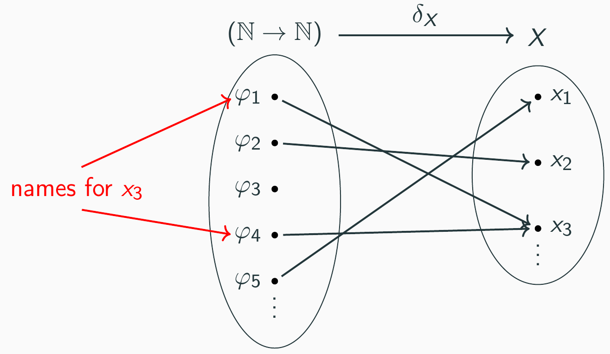

# From Coq Proofs to Certified Exact Real Computation in AERN

|Michal Konečný   | Sewon Park | Holger Thies     |
:----------------:|:----------:|:----------------:|
|Aston University | KAIST      | Kyoto University |

----

### Outline
<!-- .slide: data-auto-animate -->

* Key features of exact real computation
* Why *certified* exact real computation?
* Approaches to certified exact real computation
* Our axiomatisation of constructive real numbers
* Quality of our certified programs

----

### Outline
<!-- .slide: data-auto-animate -->

* Key features of exact real computation
* Why *certified* exact real computation?
* Approaches to certified exact real computation
* Our axiomatisation of constructive real numbers
  * Key programming features
  * Key verification features
* Quality of our certified programs

>>>>

## Key features of exact real computation

* By design, it avoids errors due to rounding
* ... but it has its own subtleties.

----

### Limits

```Haskell [-|2-3|5-10]
restr_sqrt x = 
  limit $ 
    \n -> sqrt_approx_fast x n
 
sqrt_approx_fast x n =
 sqrt_approx x (1 + (integerLog2 (n+1)))
  
sqrt_approx x n =
 let heron_step y = (y + x/y)/2 in
 (iterate heron_step 1) !! n
``` 

* fast approximation: $|\mathrm{error}| \leq \frac{1}{2^n}$

----

### Semi-decidable comparisons -> parallelism/non-determinism

```Haskell [1|3-4|4-5|6-8]
realmax_parallel x y = if x < y then y else x
 
realmax_nondeterministic x y =
 limit $ \n ->
   let e = 0.5^n in
   if select (x > y - e) (y > x - e)
                then x      
                            else y
```
<a href="https://www.geogebra.org/calculator/eb52xeed"></a>

----

### Non-extensionality, search

```Haskell
magnitude1 x = -- precondition: 0 < x < 0.5
 integer $ fromJust $ List.findIndex id $ map test [0..]
 where
 test n = select (0.5^(n+2) < x) (x < 0.5^(n+1))
```

<a href="https://www.geogebra.org/m/cgqkwfeb"></a>
$$\scriptsize
\forall x, 0 < x \leq 0.5 \implies \frac{1}{2^{m_1(x)+2}} < x \leq \frac{1}{2^{m_1(x)}}
$$

>>>>

## Why *certified* exact real computation?

Limits, non-determinism can easily go wrong 
<br/>
→ formal verification worthwhile

----

### Our aims

* Reliability
  * Readable specification
  * Small trusted base
  
* Smooth development
  * specification, algorithms and verification
  * Readable algorithms

* Fast execution 
  * eg like iRRAM, CDAR, AERN

>>>>

## Approaches to certified exact real computation

* **dependently-typed** / HO logic

* constructive / classical logic (or **both**)

* concrete / **abstract** real types

* size of trusted base

----

### Logic (1/2)

* HOL
  * `max : R → R → R := `... (program)
  * `Theorem max_meets_spec:`
    * `$\scriptsize\forall x\, y: (x>y \implies r=x)\land\ldots$`
      * where `$\scriptsize r=\text{max}\, x\, y$`

* Dependently-typed
  * `max:` `$\small\forall (x\, y:\text{R}), \{r\,|\,(x>y \to r=x)\land\ldots\}$`

----
<!-- .slide: data-auto-animate -->
### Logic (2/2)

<table>
  <tr>
    <td>Constructive</td>
    <td>$\text{Set}$</td>
    <td>$\{ \_ | \_ \}$</td>
    <td>$\{\_\}+\{\_\}$</td>
    <td></td>
    <td>$\forall$</td>
    <td>$\to$</td>
    <td>$\land$</td>
  </tr>
  <tr>
    <td>Classical</td>
    <td>$\text{Prop}$</td>
    <td>$\exists \_,\_$</td>
    <td style="text-align:center;">$\_\lor\_$</td>
    <td></td>
    <td>$\forall$</td>
    <td>$\to$</td>
    <td>$\land$</td>
  </tr>
</table>

e.g.:

* `$\scriptsize\forall x y : \mathbb{R}, (x > y) \lor(x = y) \lor(x < y)$` &nbsp;&nbsp;&nbsp;&nbsp; OK

* `$\scriptsize\forall x y : \mathbb{R}, \{x > y\} + \{x = y\} + \{x < y\}$` KO

----
### Logic (2/2)
<!-- .slide: data-auto-animate -->
<table>
  <tr>
    <td>Constructive</td>
    <td>$\text{Set}$</td>
    <td>$\{ \_ | \_ \}$</td>
    <td>$\{\_\}+\{\_\}$</td>
    <td></td>
    <td>$\forall$</td>
    <td>$\to$</td>
    <td>$\land$</td>
  </tr>
  <tr>
    <td>Classical</td>
    <td>$\text{Prop}$</td>
    <td>$\exists \_,\_$</td>
    <td style="text-align:center;">$\_\lor\_$</td>
    <td></td>
    <td>$\forall$</td>
    <td>$\to$</td>
    <td>$\land$</td>
  </tr>
</table>


----

### Types of real numbers
<!-- .slide: data-auto-animate -->

* concrete using names
  * e.g., `$\scriptsize R = \{\xi : N \to Q \,|\,\xi \text{ is fast convergent} \} / (==)$`
  * the quotient often ignored, working with names

* abstract using axioms
  * e.g., R is an Archimedean ordered field 
    * computational: 0,1 : R, + : R → R → R, ...
    * specification: +-comm, ...
----

### Types of real numbers
<!-- .slide: data-auto-animate -->

* concrete using names
* abstract using axioms
  * e.g., R is an Archimedean ordered field 
    * computational: 0,1 : R, + : R → R → R, ...
    * specification: +-comm, ...
  * or axioms corresponding to more convenient/efficient real operations
    * e.g., of_Q : Q → R

----

### Types of real numbers
<!-- .slide: data-auto-animate -->

* concrete using names
* abstract using axioms
  * notion of equality
    * extensional: x = y with x < y ∨ x = y ∨ x > y
    * intensional: x == y := ¬ (x > y) ∧ ¬ (x < y)



----

### Types of real numbers
<!-- .slide: data-auto-animate -->


----

### Size of trusted base

* CoRN, Incone - execution inside Coq
* CoRN, Incone - extraction to Haskell/OCaml
* cAERN - extraction to Haskell + AERN2


Notes:
* CoRN, Incone execution inside Coq
  * trusts: Coq core, Coq VM

* CoRN, Incone extraction to Haskell/OCaml
  * trusts: Coq core, Coq extraction, Haskell/OCaml Integer arithmetic (gmp)

* cAERN
  * trusts: + AERN (select, limit, etc), CDAR (MP interval arithmetic)

>>>>

## Our axiomatisation of constructive real numbers

* Key programming features

* Key verification features

----

### Key programming features

----

### Key verification features

>>>>

## Quality of our certified programs

* Reliability

* Smooth development

* Execution speed

----
### Reliability

----
### Smooth development

----
### Execution speed
