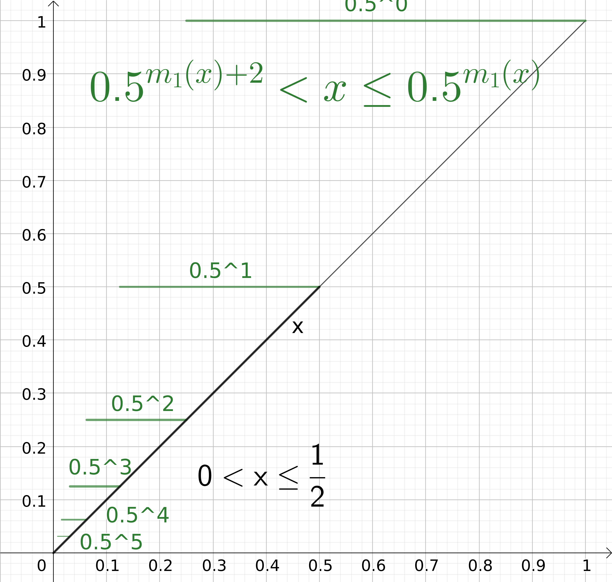
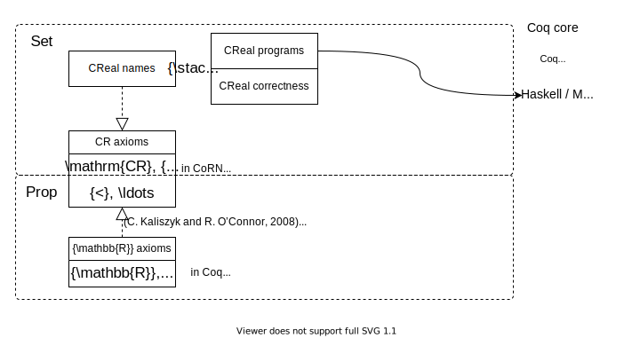
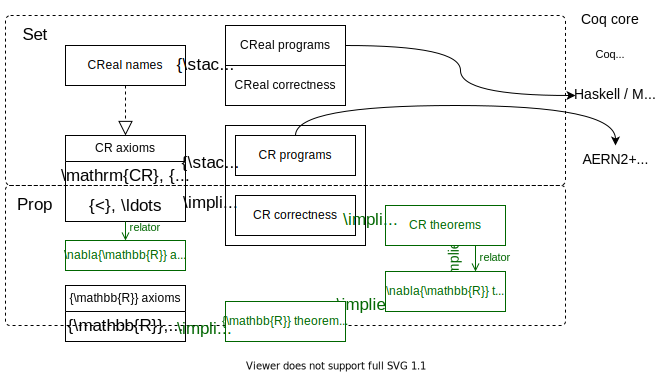

# From Coq Proofs to Certified Exact Real Computation in AERN

<br/>

|Michal Konečný|Sewon Park|Holger Thies|
|:---------------:|:----------:|:----------------:|
|Aston University|KAIST|Kyoto University|

27/07/2021, CCA 2021  <!-- .element: style="font-size: 70%;" -->

Notes:

Hello everyone,  I will talk about joint work with Sewon Park and Holger Thies on a new approach to developing certified exact real programs using the Coq proof assistant and the Haskell library AERN.

----

From Coq Proofs to <br/> Certified Exact Real Computation in AERN

<br/>

### Plan

1. Key features of *exact real computation*; why certify?
2. Our approach to certification vs others
3. Our *axiomatisation* of constructive real numbers
4. *Relating* constructive and classical real numbers
5. *Quality* of our certified programs

[https://michalkonecny.github.io/caern-cca2021-slides/](https://michalkonecny.github.io/caern-cca2021-slides/)

Notes:

1. The plan is to start with a reminder of what exact real computation looks like using a few examples, and why it is desirable to do a formal verification / certification of such programs.
2. Then I will review several existing approaches and show they differ and what they have in commonc,
3. followed by key details of our approach, namely formal axiomatisation of the real numbers
4. and their relation to standard classical real numbers present in Coq.
5. Finally, I will evaluate the approach from various angles and outline further work.

>>>>

## Key features of exact real computation

* By design, it avoids errors due to rounding
* ... but it has its own subtleties.

Notes:

I do not need to introduce the concept of real numbers datatype and its benefits over approximate computation.
Let us remind ourselves of its subtleties.

----

### Limits

```Haskell [1-3|8-10|5-6]
sqrt_approx x n =
 let heron_step y = (y + x/y)/2 in
 (iterate heron_step 1) !! n

sqrt_approx_fast x n =
 sqrt_approx x (1 + (integerLog2 (n+1)))

restr_sqrt x = -- restricted to 0.25 < x < 2
  limit $ 
    \n -> sqrt_approx_fast x n  
```

* fast approximation: $|\mathrm{error}| \leq \frac{1}{2^n}$

Notes:

Here we define the Heron method for approximating the square root of real number x by iterating n times.

The square root function is defined as a limit of this function with increasing n.  The limit operator requires a fast-converging sequence of approximations.  While sqrt_approx produces a fast convergent sequence, it converges unnecessarily fast.  sqrt_approx_fast reduces the convergence rate closer to the rate required by the limit operator.

It is easy to get this wrong and write a limit that does not produce valid a real number.  We need to certify that the sequence converges and that it convergences sufficiently fast.  

----

### Semi-decidable comparisons → parallelism/non-determinism

```Haskell [1|3-4|4-5|6-8]
realmax_parallel x y = if x < y then y else x
 
realmax_nondeterministic x y =
 limit $ \n ->
   let e = 0.5^n in
   if select (x > y - e) (y > x - e)
                then x      
                            else y
```


<a href="https://www.geogebra.org/calculator/eb52xeed">
$\tiny\text{(animated version)}$</a>

Note:

Semi-decidability of order means that we cannot branch based on order the usual way.  This if-then-else actually works in AERN, but it is redefined to execute both branches in parallel while the lazy Boolean condition is undecided and merge the information from both branches, assuming that they compute the same number if the condition is never decided (ie x = y in this case).
We need to certify this assumption if we use this approach.

To avoid parallelism, we tend to use a limit and the select/choose command to compute an approximation.  A select is non-deterministic, ie the two semi-decidable conditions sometimes both hold and the select can choose freely between the branches.  Limit here has to work for a multi-valued function and we want a guarantee that the result is single-valued.

<!-- ----

### Non-extensionality, search

```Haskell
magnitude1 x =
 integer $ fromJust $ List.findIndex id $ map test [0..]
 where
 test n = select (0.5^(n+2) < x) (x < 0.5^(n+1))
```


<a href="https://www.geogebra.org/m/cgqkwfeb">
$\tiny\text{(GeoGebra source)}$</a>

Notes:

This program computes a version **of integer logarithm** for x in this domain.  As integer logarithm (like the floor function) is discontinuous, we cannot compute it.  Instead we need to compute a multivalued (non-deterministic, non-extensional) version with a loosened specification.  Support for such non-extensional functions is unavoidable in ERC.

Another notable feature of this program is **unguarded recursion/search**.  

? This poses a challenge for formalization since proof assistants usually strongly encourage syntactically guarded recursion. -->

----

### Why *certified* exact real computation?

Limits, non-determinism can easily go wrong
<br/>
→ formal verification worthwhile

----

## Our aims

* Reliability via verification
  * Readable specification
  * Small trusted base
  
* Smooth development
  * Specification, algorithms and proofs
  * Readable algorithms

* Fast execution 
  * eg like iRRAM, Ariadne, CDAR, AERN

Notes:

It should not take too long to write the specification and the verified algorithm.

>>>>

## Approaches to certified exact real computation

* **dependently-typed** / HO logic

* constructive / classical logic (or **both**)

* concrete / **abstract** real types

* size of trusted base

* Access to classical theorems on $\RR$

Notes:

There are already various approaches to certified ERC.  How does ours differ and how it build on existing work?  Approaches differ in their choice of logic and choice of real type, which usually impacts the size of trusted base and access to existing classical theorems (if any).

----

### Logic (1/2)

* HOL
  * `max : R → R → R :=` ... (program)
  * `Theorem max_meets_spec:`
    * `$\scriptsize\forall x\, y: (x>y \implies r=x)\land\ldots$`
      * where `$\scriptsize r=\text{max}\, x\, y$`

* Dependently-typed
  * `max:` `$\small\forall (x\, y:\text{R}), \{r\,|\,(x>y \to r=x)\land\ldots\}$`
  * proofs = programs

Notes:

First we need a sufficiently powerful logic.  Some proof assistants, including Isabelle, support a **higher-order logic**, where one would clearly separate definitions of terms and programs from the statements and proofs of their properties.  Here, the theorem says that if r is the result (of type real) of calling function max for x, y then r equals the larger of x, y.

On the other hand, assistants such as Coq, Agda and Lean are based on a **dependently-typed logic** where the program and its specification are mingled.  For example, here the **return type** of max already expresses that the return value equals the larger of x, y.  Writing the program for max and proving its specification is also mingled and using the same language.

**We chose the dependant-type approach and the proof assistant Coq.**

----
<!-- .slide: data-auto-animate -->
### Logic (2/2)

<table>
  <tr>
    <td>Constructive</td>
    <td>$\text{Set}$</td>
    <td>$\{ \_ | \_ \}$</td>
    <td>$\{\_\}+\{\_\}$</td>
    <td></td>
    <td>$\forall$</td>
    <td>$\to$</td>
    <td>$\land$</td>
  </tr>
  <tr>
    <td>Classical</td>
    <td>$\text{Prop}$</td>
    <td>$\exists \_,\_$</td>
    <td style="text-align:center;">$\_\lor\_$</td>
    <td></td>
    <td>$\forall$</td>
    <td>$\to$</td>
    <td>$\land$</td>
  </tr>
</table>

e.g.:

* `$\scriptsize\forall x y : \RR, (x > y) \lor(x = y) \lor(x < y)$` &nbsp;&nbsp;&nbsp;&nbsp; OK

* `$\scriptsize\forall x y : \RR, \{x > y\} + \{x = y\} + \{x < y\}$` KO

Notes:

Proofs as programs works well for constructive proofs.  Proofs of specification can also use constructive reasoning but does not have to.  
Many developers find it easier to use classical reasoning when verifying real number properties and it would be convenient if we could use the existing libraries of classically proved theorems.  Thus we want both: purely constructive reasoning about how result values depend on input values + more flexible reasoning about the (dependent) type of result values.

We will use the Coq conventions to differentiate between constructive and classical constructions.  The type Set is normally reserved for types of constructive values while Prop is a type of statements for which we do not assume any constructive content.  For example, a **constructive or**, applied to constructive sets gives a constructive disjoint union of these sets, and uses a notation that reminds us of this fact, unlike the usual notation for logical or.  For example, real order trichotomy holds classically but not constructively since real order is only semi-decidable.

Similarly, the constructive existential quantifier gives a construction (rather than just an assumption of existence) of the witness with the proof that it is a witness.

----
### Logic (2/2)
<!-- .slide: data-auto-animate -->
<table>
  <tr>
    <td>Constructive</td>
    <td>$\text{Set}$</td>
    <td>$\{ \_ | \_ \}$</td>
    <td>$\{\_\}+\{\_\}$</td>
    <td></td>
    <td>$\forall$</td>
    <td>$\to$</td>
    <td>$\land$</td>
  </tr>
  <tr>
    <td>Classical</td>
    <td>$\text{Prop}$</td>
    <td>$\exists \_,\_$</td>
    <td style="text-align:center;">$\_\lor\_$</td>
    <td></td>
    <td>$\forall$</td>
    <td>$\to$</td>
    <td>$\land$</td>
  </tr>
</table>


Notes:

This diagram shows how due to this dual world we usually have two real number types in Coq:  The classical real numbers and the constructive real numbers.  This picture is true of the Coq standard library as of recent versions.  The Coq libraries CoRN and Incone provide their own constructive real numbers and means to derive exact real programs mingled with their specifications and certifications.  These programs can be executed directly within Coq, or extracted to behaviourally equivalent Haskell or OCaml programs.  In CoRN both the program and its correctness verification use Set constructive reasoning.  In Incone the correctness reasoning can use classical logic.

In both CoRN and Incone, the formalization works directly with names of real numbers rather than real numbers.  Names are mapped to real numbers via a suitable representation, which are always redundant:

----

### Types of real numbers
<!-- .slide: data-auto-animate data-auto-animate-restart -->

* concrete using names
  * e.g., `$\scriptsize R = \{\xi : N \to Q \,|\,\xi \text{ is fast convergent} \} / (==)$`
  
  * the quotient often ignored, working with names


Notes:

Here, ξ is a name of a real number using a fast Cauchy representation of real numbers.

----

### Types of real numbers
<!-- .slide: data-auto-animate -->

* concrete using names
  * e.g., `$\scriptsize R = \{\xi : N \to Q \,|\,\xi \text{ is fast convergent} \} / (==)$`
  
  * the quotient often ignored, working with names

* abstract using axioms
  * e.g., $R$ is an Archimedean ordered field 
    * computational: &nbsp; `$\scriptsize 0,1 : R,\, + : R → R → R,\,\ldots$`

    * specification: &nbsp; `$\scriptsize+\text{-comm} : \forall x\,y, x{+}y = y{+}x,\,\ldots$`

Notes:

Since there are many representations of the reals, some simpler and some more complicated, aimed at efficient execution, it is helpful to abstract away from names via an axiomatisation.

In CoRN and Coq standard library, there is an axiomatisation of constructive real numbers independent of names: 

----

### Types of real numbers
<!-- .slide: data-auto-animate -->



Notes:

The axiomatisation contains a Prop-based order which may be reasoned about classically, although as far as I understand, is not normally done in CoRN or the standard library.

This axiomatisation caters for models with names as can be seen in its intensional equality:

----

### Types of real numbers
<!-- .slide: data-auto-animate -->

* concrete using names
* abstract using axioms
  * notion of equality
    * extensional: `$\scriptsize x = y \text{ with } x < y ∨ x = y ∨ x > y$`
    * intensional: `$\scriptsize x == y  \;~\;  ¬ (x > y) ∧ ¬ (x < y)$`


Notes:

We prefer an axiomatisation with extensional equality in which the order trichotomy classically holds.  This approach also makes it easier to connect the constructive reals to the Coq classical reals.

----

### Types of real numbers
<!-- .slide: data-auto-animate -->

* concrete using names
* abstract using axioms
  * e.g., $R$ is an Archimedean ordered field 
    * computational: &nbsp; `$\scriptsize 0,1 : R,\, + : R → R → R,\,\ldots$`

    * specification: &nbsp; `$\scriptsize+\text{-comm} : \forall x\,y, x{+}y = y{+}x,\,\ldots$`

  * or axioms corresponding to more convenient/efficient real operations
    * e.g., `$\scriptsize\mathrm{of\_Q} : Q → R$`

----

### Size of trusted base

* CoRN, Incone - execution inside Coq
* CoRN, Incone - extraction to Haskell/OCaml
* cAERN - extraction to Haskell + AERN2


Notes:

* CoRN, Incone execution inside Coq
  * trusts: Coq core, Coq VM

* CoRN, Incone extraction to Haskell/OCaml
  * trusts: Coq core, Coq extraction, Haskell/OCaml Integer arithmetic (gmp)

* cAERN
  * trusts: + AERN (select, limit, etc), CDAR (MP interval arithmetic)

----

### Access to classical theorems on $\RR$



* In cAERN, and (in another way) in Incone

>>>>

## Our axiomatisation of constructive real numbers

* Real field
* Order and identity (classical)
* Semidecidable tests, partial functions
* Non-deterministic choice
* Multivalued/non-deterministic computation monad
* Limit
* Relating standard reals (`∇`, `relator`)

----
<!-- .slide: data-auto-animate -->
### Real field

```Coq
Axiom CR : Set.
Axiom CR0 : CR.
Axiom CR+ : CR -> CR -> CR.
...
```

(more to follow)

----
<!-- .slide: data-auto-animate -->
### Real field

```Coq
Axiom CR : Set.
Axiom CR0 : CR.
Axiom CR+ : CR -> CR -> CR.
...
```

### Order and identity (classical)

```Coq
Axiom CRlt : CR -> CR -> Prop. (* Notation "<" *)
Axiom CRtotal_order : 
  ∀ r1 r2 : CR, r1 < r2 \/ r1 = r2 \/ r2 < r1.
```

----
<!-- .slide: data-auto-animate -->
### Real field

```Coq
Axiom CR : Set.
Axiom CR0 : CR.
Axiom CR+ : CR -> CR -> CR.
...
```

### Order and identity (classical)

```Coq
Axiom CRlt : CR -> CR -> Prop. (* Notation "<" *)
Axiom CRtotal_order : 
  ∀ r1 r2 : CR, r1 < r2 \/ r1 = r2 \/ r2 < r1.
```

| classical  |  constructive |
|:--:|:--:|
| `x<y : Prop` | `semidec(x<y) : Set` |

----

### Semidecidable tests, partial functions

| classical  |  constructive |
|:--:|:--:|
| `x<y : Prop` | `semidec(x<y) : Set` |

```Coq [1-3|5-7|9,11]
Axiom K : Set.
Axiom trueK : K.
Axiom falseK : K.
 
Definition upK : K -> Prop := fun k : K => k = trueK.
 
Definition semidec := fun P : Prop => {k : K | upK k <-> P}.

Usage:

Axiom CRlt_semidec : ∀ x y : CR, semidec (x < y).
```

----

### Non-deterministic choice

* two Kleeneans, at least one is True (classically)
* can non-deterministically choose (constructively):

```Coq [1-3|5-9]
Definition select : 
  ∀ p q, semidec p -> semidec q -> p \/ q -> M ({p}+{q}).  
Proof. ... (* using select *)

example usage:

Definition M_split : 
  ∀ x y ε, ε > CR0 -> M ({x > y-ε} + {y > x-ε}).
Proof. ... (* using select *)

```

<!-- ----

### Multivalued/non-deterministic computation monad

```Coq [1-5|7|9-10]
Axiom M : Type -> Type.
Axiom liftM : ∀ A B, (A -> B) -> M A -> M B.
Axiom unitM : ∀ T : Type, T -> M T.
Axiom multM : ∀ T : Type, M (M T) -> M T.
...

Definition singletonM : ∀ A, isSubsingleton A -> M A -> A.

Definition countableLiftM : 
  ∀ P : nat -> Type, (∀ n, M (P n)) -> M (∀ n, P n).
``` -->

----

### Limit

```Coq [1-2|4-5|7-9]
Definition is_fast_cauchy_p (f : nat -> CR) := 
  ∀ n m, | f n - f m | <= prec n + prec m.

Definition is_fast_limit_p (x : CR) (f : nat -> CR) := 
  ∀ n, | x - f n | <= prec n.
 
Axiom limit :
  ∀ f : nat -> CR, 
    is_fast_cauchy_p f -> {x | is_fast_limit_p x f}.
```

`prec n = ` $2^{-n}$

----

### `mslimit`

Non-deterministic sequence, deterministic result

```Coq [9-11,13|12]
Definition singletonM : ∀ A, isSubsingleton A -> M A -> A.
Definition countableLiftM : 
  ∀ P : nat -> Type, (∀ n, M (P n)) -> M (∀ n, P n).

Axiom limit :
  ∀ f : nat -> CR, 
    is_fast_cauchy_p f -> {x | is_fast_limit_p x f}.

Definition mslimit :
  ∀ (P : CR -> Prop),
    (∃! z, P z) ->
    (∀ n, M {e | (∃ z, P z /\ dist e z <= prec n)}) -> 
    {z | P z}.
```

----

### Maximum via `mslimit`

```Haskell
realmax_nondeterministic x y =
 limit $ \n ->
   if select (x > y - 0.5^n) (y > x - 0.5^n)
                then x      else y
```


<a href="https://github.com/holgerthies/coq-aern/blob/d600a52e4fa0ad0750dd1ecf7d3c1c15b9b951c3/formalization/Minmax.v#L111">
$\tiny\text{(Full Coq source)}$
</a>
<a href="https://github.com/holgerthies/coq-aern/blob/d600a52e4fa0ad0750dd1ecf7d3c1c15b9b951c3/extracted-examples/src/Max.hs#L42">
$\tiny\text{(Full Haskell source)}$
</a>

----
<!-- .slide: data-auto-animate -->
### Relating standard reals

* For Coq standard reals we have:
```Coq
∀ x : ℝ, 0 < x → ({ y : ℝ | x = y * y } : Set)
```
  * Set depending on non-constructive axioms
    * e.g. `∀ x y : ℝ, {x<y}+{x=y}+{x>y}`

* ∇ erases fake constructive aspects
```Coq
∀ x : ∇ℝ, 0 < x → ({ y : ∇ℝ | x = y * y } : Set)
```
* By `relate` axioms this implies what we need:
```Coq
∀ x : CR, 0 < x → ((∃ y : CR, x = y * y) : Prop)
```

Notes:

Sewon:
To put formally, results from classical libraries that uses unrealizable axioms such as Set level law of excluded middle and so on live in Set in a different type theory.
And, our relator brings it into Prop-level theorem in our constructive type theory by wrapping it with \nabla.

----
<!-- .slide: data-auto-animate -->
### Relating standard reals


```Coq
∀ x : ℝ, 0 < x → ({ y : ℝ | x = y * y } : Set) (* Decidable < *)

    ∀ x : ∇ℝ, 0 < x → { y : ∇ℝ | x = y * y } (* Semidecidable < *)

        ∀ x : CR, 0 < x → ((∃ y : CR, x = y * y) : Prop)
```

----
<!-- .slide: data-auto-animate -->
### Relating standard reals

`$$\nabla A :\equiv \{P : A \to \mathrm{Prop}\; |\; \exists!(x : A), P\; x\}$$`

* $\nabla$ is an idempotent monad
* $\nabla\text{Prop} = \text{Prop}$
* Naturally defined lifting for constants, functions, relations

```Coq [1|3|4-5|7-8]
Axiom relator : CR → ∇ℝ.
...
Axiom relator_constant0 : relator CR0 = unit∇ 0.
Axiom relator_addition : ∀ x y, relator (x + y) = 
  (lift_binary∇ (+)) (relator x) (relator y).
...
Axiom relator_lt : ∀ x y, x < y = 
  (lift_domain_binary∇ (<)) (relator x) (relator y).
```
(simplified version)

>>>>

## Quality of our certified programs

* Reliability

* Smooth development

* Execution speed

----
### Reliability

<br/>

* Need to trust **only**:
  * Coq core, Coq extraction
  
  * Haskell compiler, base libraries
  * CDAR, AERN2

----

### Smooth development

* Fact about Coq standard $\RR$ available, eg Coquelicot

* Coq tactics help transfer
* Specifications are readable
* Algorithms readability an issue, but can be improved

----
### Execution speed


$\tiny\text{(i7-4710MQ CPU, 16GB RAM, Ubuntu 18.04, Haskell Stackage LTS 17.2)}$

>>>>

## Summary

* Progress towards practical certified efficient reals
* Using Coq, Coq standard reals, Haskell/AERN2
* With new axiomatisation of constructive reals

<br/>
<br/>

## Future work

* Formally prove consistency and completeness of axioms
* Non-deterministic limits (eg complex sqrt)
* More programs, eg trigs, linear algebra, theorem proving, optimisation, ODE/PDE integration
* Extraction to other frameworks (CDAR, iRRAM, Ariadne)
* Alternative execution inside Coq via Incone, CoRN

----

## Thank you!

